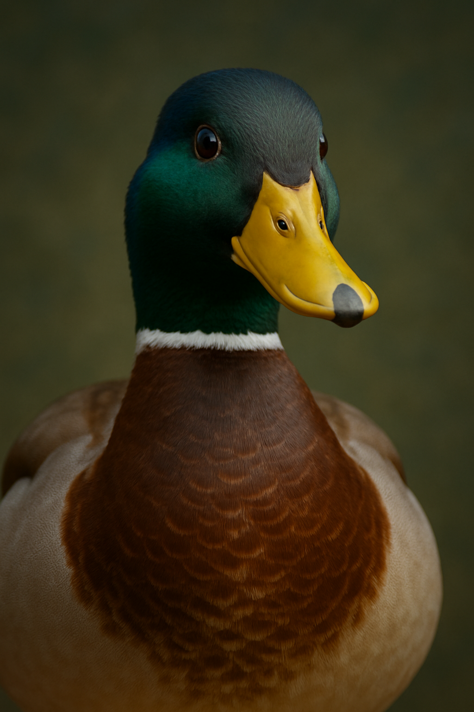

# Headphones Landing Page 🎧



## Description

This project is a fully responsive landing page for a headphones company, implemented from scratch without any external CSS frameworks or JavaScript libraries. The design was created by Nicolas Philippot, UI/UX designer, and has been faithfully reproduced using pure HTML and CSS.

## Features

- ✨ **Fully Responsive Design**: Seamlessly adapts to desktop, tablet, and mobile devices (switches to mobile layout at 480px width)
- 🎨 **Pixel-Perfect Implementation**: Matches the Figma design specifications exactly
- ♿ **Accessibility-Focused**: Built with semantic HTML and accessibility best practices
- 🚀 **Performance Optimized**: No external dependencies, lightweight and fast-loading
- 🎯 **Interactive Elements**: Hover states and transitions for enhanced user experience
- 🎪 **Bonus Animations** (101 files): Fun animations including floating, bouncing, rotating, and pulsing effects

## Project Structure

```
holbertonschool-headphones/
│
├── 0-index.html        # Task 1: Header/Hero section
├── 0-styles.css        # Styles for header/hero
│
├── 1-index.html        # Task 2: "What we do" section
├── 1-styles.css        # Includes previous + what we do styles
│
├── 2-index.html        # Task 3: "Our results" section
├── 2-styles.css        # Includes previous + results styles
│
├── 3-index.html        # Task 4: Contact form
├── 3-styles.css        # Includes previous + contact styles
│
├── 4-index.html        # Task 5: Complete page with footer
├── 4-styles.css        # Complete stylesheet
│
├── 101-index.html      # Bonus: Animated version with fun effects
├── 101-styles.css      # Enhanced styles with animations
│
└── images/             # Project images and icons
```

## Design Specifications

### Colors
- Primary Color: `#FF6565` (Red/Coral)
- Text Color: `#071629` (Dark Blue)
- White: `#FFFFFF`

### Typography
- **Primary Font**: Source Sans Pro
- **Special Font**: Spin Cycle OT (for decorative elements)

### Breakpoints
- Desktop: > 480px
- Mobile: ≤ 480px

### Layout
- Maximum content width: 1000px (centered)
- Responsive grid system
- Mobile-first approach

### Interactive States
- Links hover/active: `#FF6565`
- Button hover/active: `opacity: 0.9`
- Smooth transitions on all interactive elements

## Sections

1. **Header/Hero**
   - Navigation menu with responsive hamburger icon
   - Hero section with call-to-action button
   - Background image with overlay

2. **What We Do**
   - Four service cards with custom icons
   - Responsive grid layout
   - Icon animations on hover

3. **Our Results**
   - Pentagon-shaped result displays
   - Statistics presentation
   - Animated percentage indicators

4. **Contact Us**
   - Functional contact form
   - Form validation (HTML5)
   - Styled input fields and submit button

5. **Footer**
   - Social media links
   - Copyright information
   - Responsive layout

### Bonus: Animated Version (101 files)

The `101-index.html` and `101-styles.css` files include enhanced animations:

**"What We Do" Section:**
- Fade-in up entrance animation with staggered delays
- Continuous floating animation on icons
- 360° rotation with scale on hover
- Color transitions and shadow effects

**"Our Results" Section:**
- Zoom-in entrance animation
- Continuous pulsing effect on pentagons
- 180° flip transformation on hover
- Dynamic color changes and drop shadows

**Animation Types Included:**
- `fadeInUp`: Smooth entrance from bottom
- `zoomIn`: Scale entrance effect
- `float`: Gentle floating movement
- `pulse`: Breathing/pulsing effect
- `bounce`: Playful bounce animation
- `rotate`: Full rotation animation
- `shake`: Side-to-side movement

## Browser Compatibility

- Chrome (latest)
- Firefox (latest)
- Safari (latest)
- Edge (latest)

## Development Approach

### CSS Architecture
- CSS Reset for consistent cross-browser styling
- CSS Variables for maintainable theming
- BEM methodology for class naming
- Mobile-first responsive design

### HTML Structure
- Semantic HTML5 elements
- ARIA labels for accessibility
- Optimized for SEO

## Installation

1. Clone the repository:
```bash
git clone https://github.com/FredBourouliou/holbertonschool-headphones.git
```

2. Navigate to the project directory:
```bash
cd holbertonschool-headphones
```

3. Open any HTML file in your browser to view the corresponding section:
```bash
open 4-index.html   # For the complete page
open 101-index.html # For the animated version
```

## Author

Frédéric Bourouliou - Holberton School Student

## Acknowledgments

- Design by Nicolas Philippot, UI/UX Designer
- Holberton School for the project requirements
- The amazing duck for moral support 🦆

## License

This project is part of the Holberton School curriculum.